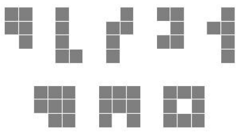

### 【题目链接】
[UVa 1602](https://uva.onlinejudge.org/index.php?option=com_onlinejudge&Itemid=8&page=show_problem&problem=4477) Lattice Animals

### 【题目描述】
输入$n、w、h$ (1 <= n <= 10, 1 <= w, h <= n)， 求能放在$w\*h$网格里的本质不同的$n$连块的个数。
本质不同，即旋转、平移、翻转后相同的算一种。
例如，2\*4里的5连块有5种（下图第一行），3\*3里的8连块有3种（下图第二行）：

每组输入数据有多个询问。

<!--more-->

---

### 【解题思路】
回溯法求解，即每个n连块都可以由n-1连块添加一个块得到，从1连块（只有一种）开始搜。

那么本题难点来了，如何判重？

借助`std::set`，可以相对方便的完成判重，不考虑效率的话。
首先表示格子的结构体是必要的，我们定义为`Cell`
```c++
struct Cell{
    int x, y;
};
```
考虑怎样储存一个n连块，n连块是由n个格子组成的，所以：
```c++
typedef std::set<Cell> Polyomino;
```
那么，怎样判断两个Polyomino本质不同呢？
针对平移，我们对Polyomino进行标准化，即将每一个Polyomino都平移到坐标原点位置。
```c++
inline Polyomino normalize(const Polyomino &poly){
    int minX = INT_MAX, minY = INT_MAX;
    ForCell(cell, poly){
        minX = std::min(minX, cell->x);
        minY = std::min(minY, cell->y);
    }
    Polyomino newPoly;
    ForCell(cell, poly)
        newPoly.insert(Cell(cell->x - minX, cell->y - minY));
    return newPoly;
}
```

注意，为化简代码，这里用到了一些宏定义（也是被STL的迭代器逼到这个地步...），写法如下
```c++
#define ForCell(CELL, POLY) for(Polyomino::iterator CELL = (POLY).begin(); CELL != (POLY).end(); CELL++)

#define ForPoly(POLY, POLYS) for(std::set<Polyomino>::iterator POLY = (POLYS).begin(); POLY != (POLYS).end(); POLY++)
```

针对旋转与翻转，我们分别写出对一个Polyomino进行旋转和翻转的操作。
```c++
// 将poly顺时针旋转90度
inline Polyomino rotate(const Polyomino &poly){
    Polyomino newPoly;
    ForCell(cell, poly)
        newPoly.insert(Cell(cell->y, -cell->x));// 数学上的坐标变换啦
    return normalize(newPoly);
}
// 我才没有想到各种平衡树呢qwq

// 将poly以x轴为轴进行翻转
inline Polyomino flip(const Polyomino &poly){
    Polyomino newPoly;
    ForCell(cell, poly)
        newPoly.insert(Cell(cell->x, -cell->y));
    return normalize(newPoly);
}
```

这样以后，判重就变得很简单啦。
```c++
std::set<Polyomino> polys[MAXN + 1]; // polys[n]储存所有的n连块
// 检查将cell加入到poly后，形成的n连块是否出现过，如果没有，将其加入到集合中
inline void check(Polyomino poly, const Cell &cell){
    poly.insert(cell);
    poly = normalize(poly);

    int n = poly.size();
    
    for(int i = 0; i < 4; i++){
        if(polys[n].count(poly)) return;
        else poly = rotate(poly);
    } // 旋转后比较

    poly = flip(poly); // 翻转后再旋转比较一轮
    for(int i = 0; i < 4; i++){
        if(polys[n].count(poly)) return;
        else poly = rotate(poly);
    }

    polys[n].insert(poly);
}
```

因为有多组询问，所以我们考虑先将MAXN及以下连块生成，打一个表，然后$O(1)$回答

```c++
inline void generate(){
    Polyomino s;
    s.insert(Cell(0, 0));
    polys[1].insert(s);
    
    // 生成
    for(int n = 2; n <= MAXN; n++){
        ForPoly(poly, polys[n - 1]){
            ForCell(cell, *poly){
                for(int k = 0; k < 4; k++){
                    Cell newCell(cell->x + dx[k], cell->y + dy[k]);
                    if(!poly->count(newCell)) check(*poly, newCell);
                }
            }
        }
    }
   // 打表，ans[n][x][y]表示能放入x*y的n连块个数
    for(int n = 1; n <= MAXN; n++){
        for(int x = 1; x <= MAXN; x++){
            for(int y = 1; y <= MAXN; y++){
                int count = 0;
                ForPoly(poly, polys[n]){
                    int maxX = INT_MIN, maxY = INT_MIN;
                    ForCell(cell, *poly){
                        maxX = std::max(maxX, cell->x);
                        maxY = std::max(maxY, cell->y);
                    }
                    if(std::min(maxX, maxY) < std::min(x, y)
                    && std::max(maxX, maxY) < std::max(x, y)
                    ) count++;
                }
                ans[n][x][y] = count;
            }
        }
    }
}
```
这样，问题就解决了，虽然这份代码的效率不很高（用了较多STL，而且发生了不少结构体的复制），但在`-O2`下，还是能够达到要求的。当然，如果不开`-O2`的话...那就只能呵呵了。

貌似本题有更加高效的解法，可以确保每个n连块恰好被枚举一次，不过我并不会...

---
### 【AC代码】

```c++
#include <cstdio>
#include <set>
#include <algorithm>
#include <climits>

#define MAXN 10

#define ForCell(CELL, POLY) for(Polyomino::iterator CELL = (POLY).begin(); CELL != (POLY).end(); CELL++)
#define ForPoly(POLY, POLYS) for(std::set<Polyomino>::iterator POLY = (POLYS).begin(); POLY != (POLYS).end(); POLY++)

struct Cell{
    int x, y;
    Cell(int x = 0, int y = 0) : x(x), y(y) {}
    bool operator<(const Cell &a) const{
        return x < a.x || (x == a.x && y < a.y);
    }
};

typedef std::set<Cell> Polyomino;

inline Polyomino normalize(const Polyomino &poly){
    int minX = INT_MAX, minY = INT_MAX;
    ForCell(cell, poly){
        minX = std::min(minX, cell->x);
        minY = std::min(minY, cell->y);
    }
    Polyomino newPoly;
    ForCell(cell, poly)
        newPoly.insert(Cell(cell->x - minX, cell->y - minY));
    return newPoly;
}

inline Polyomino rotate(const Polyomino &poly){
    Polyomino newPoly;
    ForCell(cell, poly)
        newPoly.insert(Cell(cell->y, -cell->x));
    return normalize(newPoly);
}

inline Polyomino flip(const Polyomino &poly){
    Polyomino newPoly;
    ForCell(cell, poly)
        newPoly.insert(Cell(cell->x, -cell->y));
    return normalize(newPoly);
}

const int dx[] = { 0, 0, 1, -1 };
const int dy[] = { 1, -1, 0, 0 };

std::set<Polyomino> polys[MAXN + 1];
int ans[MAXN + 1][MAXN + 1][MAXN + 1];

inline void check(Polyomino poly, const Cell &cell){
    poly.insert(cell);
    poly = normalize(poly);

    int n = poly.size();
    
    for(int i = 0; i < 4; i++){
        if(polys[n].count(poly)) return;
        else poly = rotate(poly);
    }

    poly = flip(poly);
    for(int i = 0; i < 4; i++){
        if(polys[n].count(poly)) return;
        else poly = rotate(poly);
    }

    polys[n].insert(poly);
}

inline void generate(){
    Polyomino s;
    s.insert(Cell(0, 0));
    polys[1].insert(s);

    for(int n = 2; n <= MAXN; n++){
        ForPoly(poly, polys[n - 1]){
            ForCell(cell, *poly){
                for(int k = 0; k < 4; k++){
                    Cell newCell(cell->x + dx[k], cell->y + dy[k]);
                    if(!poly->count(newCell)) check(*poly, newCell);
                }
            }
        }
    }

    for(int n = 1; n <= MAXN; n++){
        for(int x = 1; x <= MAXN; x++){
            for(int y = 1; y <= MAXN; y++){
                int count = 0;
                ForPoly(poly, polys[n]){
                    int maxX = INT_MIN, maxY = INT_MIN;
                    ForCell(cell, *poly){
                        maxX = std::max(maxX, cell->x);
                        maxY = std::max(maxY, cell->y);
                    }
                    if(std::min(maxX, maxY) < std::min(x, y)
                    && std::max(maxX, maxY) < std::max(x, y)
                    ) count++;
                }
                ans[n][x][y] = count;
            }
        }
    }
}

int main(){
    generate();

    int x, y, n;
    while(scanf("%d%d%d", &n, &x, &y) == 3){
        printf("%d\n", ans[n][x][y]);
    }
    
    return 0;
}

```
就是这样啦