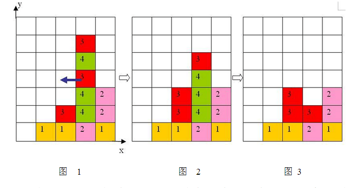
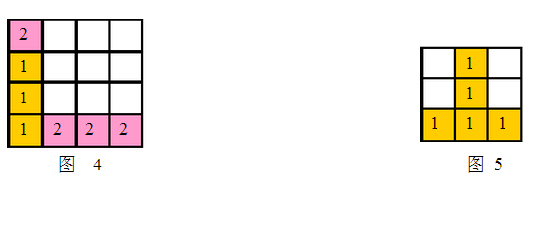

#### 【题目链接】
[CodeVS 1136](http://codevs.cn/problem/1136/) Mayan游戏
[COGS 622](http://cogs.top/cogs/problem/problem.php?pid=622) 玛雅游戏

#### 【题目描述】
Mayan puzzle 是最近流行起来的一个游戏。游戏界面是一个7 行5 列的棋盘，上面堆放着一些方块，方块不能悬空堆放，即方块必须放在最下面一行，或者放在其他方块之上。游戏通关是指在规定的步数内消除所有的方块，消除方块的规则如下：

<!--more-->

1、 每步移动可以且仅可以沿横向（即向左或向右）拖动某一方块一格：当拖动这一方块时，如果拖动后到达的位置（以下称目标位置）也有方块，那么这两个方块将交换位置（参见输入输出样例说明中的图6 到图7）；如果目标位置上没有方块，那么被拖动的方块将从原来的竖列中抽出，并从目标位置上掉落（直到不悬空，参见下面图1 和图2）；
2、 任一时刻，如果在一横行或者竖列上有连续三个或者三个以上相同颜色的方块，则它们将立即被消除（参见图1到图3）。



注意：
a) 如果同时有多组方块满足消除条件，几组方块会同时被消除（例如下面图4，三个颜色为1 的方块和三个颜色为2 的方块会同时被消除，最后剩下一个颜色为2 的方块）。
b) 当出现行和列都满足消除条件且行列共享某个方块时，行和列上满足消除条件的所有方块会被同时消除（例如下面图5 所示的情形，5 个方块会同时被消除）。

3、 方块消除之后，消除位置之上的方块将掉落，掉落后可能会引起新的方块消除。注意：掉落的过程中将不会有方块的消除。
上面图1 到图3 给出了在棋盘上移动一块方块之后棋盘的变化。棋盘的左下角方块的坐标为（0, 0），将位于（3, 3）的方块向左移动之后，游戏界面从图1 变成图2 所示的状态，此时在一竖列上有连续三块颜色为4 的方块，满足消除条件，消除连续3 块颜色为4 的方块后，上方的颜色为3 的方块掉落，形成图3 所示的局面。

##### 输入格式:
共6 行。
第一行为一个正整数 n，表示要求游戏通关的步数。
接下来的 5 行，描述7*5 的游戏界面。每行若干个整数，每两个整数之间用一个空格隔开，每行以一个0 结束，自下向上表示每竖列方块的颜色编号（颜色不多于10 种，从1 开始顺序编号，相同数字表示相同颜色）。
输入数据保证初始棋盘中没有可以消除的方块。
##### 输出格式:
如果有解决方案，输出n 行，每行包含3 个整数x，y，g，表示一次移动，每两个整数之间用一个空格隔开，其中（x，y）表示要移动的方块的坐标，g 表示移动的方向，1 表示向右移动，-1 表示向左移动。注意：多组解时，按照x 为第一关健字，y 为第二关健字，1优先于-1，给出一组字典序最小的解。游戏界面左下角的坐标为（0，0）。
如果没有解决方案，输出一行，包含一个整数-1。

#### 【解题思路】

据传这是搜索的一个极麻烦的例题，今晚终得一试，但没有想象中那么难。
**此题的难点在细节**
主算法框架选择回溯深搜。

直接搜可能超时，考虑一些优化，
由于我们的操作是交换方块，假设a在b的左边，那么右移a与左移b是等价的，所以我们统一方向，每个块只尝试右移。这个策略的优化效果很不错，状态数至少要减半。
另一个优化是针对无解情况的，因为在无解的情况下，我们要搜遍整个状态空间才敢断定该状态无解，考虑当前局面下每种颜色块的个数，如果有某种颜色的个数小于3，我们就可以判断该情况无解了，因为无论怎样移动都不能消除这几个块，这个剪枝的优化效果一般。

值得注意的一些细节~~（坑点）~~：

- 消除与下落的具体实现
  - 消除时为了处理行列交叉消除的情况，先逐行扫描，标记出在行上要消除的块，再逐列扫描，标记出在列上要消除的块，最后一并消除。
  - 下落与消除要交替进行，直到不可消除
- 棋盘坐标与我们通常使用的二维数组下标的不同
- 由上一条导致的字典序问题
- 如果我们只考虑右移，那么当我们遇到空格时，操作不是空格右移，而是空格右的块（如果有的话）左移

好像也没有那么多的样子，还是那句话，注意细节，仔细想好，引用一位神犇的名言:
> Think twice，code once;

#### 【AC代码】
```c++
#include <cstdio>
#include <algorithm>
#include <cstring>
#include <climits>

#define MAXSTEP 10

struct Operation{
    int x, y;
    int dir;

    Operation() {}
    Operation(int x, int y, int dir) : x(x), y(y), dir(dir) {}
};

const int m = 7, n = 5;

int G[m][n];
int num[11];
int N;

Operation ans[MAXSTEP];

inline bool isFinal(){
    for(int i = 0; i < m; i++) for(int j = 0; j < n; j++) if(G[i][j]) return false;
    return true;
}

inline bool clean(){
    bool f[m][n] = { false };
    for(int i = 0; i < m; i++) for(int j = 0; j < n - 2; j++) if(G[i][j]){
        int cur = G[i][j];
        int l = j, r = j + 1;
        while(cur == G[i][r]) r++;
        if(r - l >= 3) for(int k = l; k < r; k++) f[i][k] = true;
        j = r - 1;
    }
    for(int j = 0; j < n; j++) for(int i = 0; i < m - 2; i++) if(G[i][j]){
        int cur = G[i][j];
        int l = i, r = i + 1;
        while(cur == G[r][j]) r++;
        if(r - l >= 3) for(int k = l; k < r; k++) f[k][j] = true;
        i = r - 1;
    }
    bool flag = false;
    for(int i = 0; i < m; i++) for(int j = 0; j < n; j++) if(f[i][j]){
        flag = true;
        num[ G[i][j] ]--;
        G[i][j] = 0;
    }
    return flag;
}

inline void fall(){
    for(int i = 1; i < m; i++) for(int j = 0; j < n; j++) if(G[i][j]){
        for(int x = i; !G[x - 1][j] && x > 0; x--) std::swap(G[x][j], G[x - 1][j]);
    }
}

inline void pull(int d, int i, int j){
    ans[d] = (G[i][j] ? Operation(i, j, 1) : Operation(i, j + 1, -1));
    std::swap(G[i][j], G[i][j + 1]);
}

inline int minNum(){
    int ans = INT_MAX;
    for(int i = 0; i < 11; i++) if(num[i]) ans = std::min(ans, num[i]);
    return ans;
}

bool dfs(int d){
    if(d == N) return isFinal();
    else if(minNum() < 3) return false;
    else for(int j = 0; j < n - 1; j++) for(int i = 0; i < m; i++) if(G[i][j] || G[i][j + 1]){
        int oldG[m][n], oldNum[11];
        memcpy(oldG, G, sizeof G);
        memcpy(oldNum, num, sizeof num);

        pull(d, i, j);

        do fall(); 
        while(clean());

        if(dfs(d + 1)) return true;

        memcpy(num, oldNum, sizeof num);
        memcpy(G, oldG, sizeof G);
    }

    return false;
}

inline void solve(){
    if(dfs(0)) for(int i = 0; i < N; i++) printf("%d %d %d\n", ans[i].y, ans[i].x, ans[i].dir);
    else printf("-1");
}

int main(){
    // freopen("mayan.in", "r", stdin), freopen("mayan.out", "w", stdout);

    scanf("%d", &N);
    for(int j = 0; j < n; j++){
        int x;
        for(int i = 0; scanf("%d", &x) == 1 && x; i++) G[i][j] = x, num[x]++;
    }
    solve();

    // fclose(stdin), fclose(stdout);
    return 0;
}
```