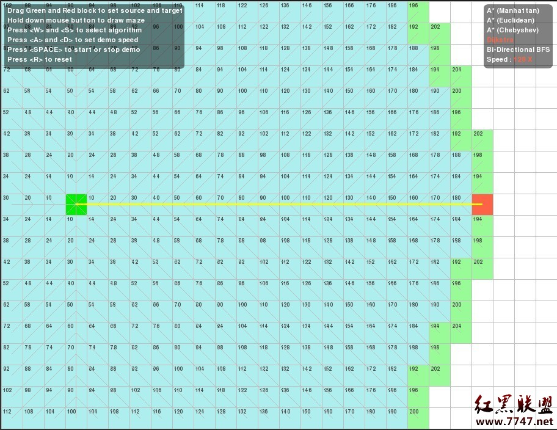
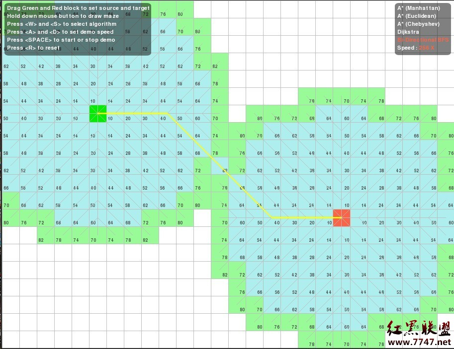

### 【题目链接】
[COGS 2070](http://cojs.tk/cogs/problem/problem.php?pid=2070) 万圣节后的早晨

### 【题目描述】
$w*h$的网格上有$n$个小写字母(代表鬼)。要求把他们分别移动到对应的大写字母里。每一步可以有任意数量的鬼同时移动。每个鬼要么待在原地不动，要么移动到相邻的格子里（相邻的格子有公共边），每步移动后任何两个鬼不能占用同一个位置，也不能在一步之内交换位置。

输入数据保证所有空格连通，所有障碍格也连通，且任何一个2*2的网格中至少有一个障碍格。输出最少步数，输入数据保证有解。
数据范围:  $4 ≤ w, h ≤ 16, 1 ≤ n ≤ 3$

<!--more-->

---

### 【解题思路】
其实就是三个人(鬼)走迷宫，准备开搜，以三个鬼的位置为状态，转化为无权图上最短路，采取BFS解决。但是直接的暴搜可能行不通，状态上界大概能达到$256^3$的样子，每次需要$5^3$的枚举走法，状态后继比较多，限于内存，判重也是个问题，所以最好进行优化。

首先考虑优化转移的代价，题目中条件 _任何一个2*2的网格中至少有一个障碍格_ 暗示着我们障碍格很多，也就是说每个格子合法的转移位置大多数达不到5个。那么考虑预处理，预处理出每个格子能够转移到的位置，而不是用时再进行判断，这样优化以后，只考虑可行格子，状态数上界大概降到能够用数组判重的水平，一般的BFS就可以通过本题数据了。

除此之外，我们还可以考虑使用双向的BFS搜索，即从起始状态和结束状态两头搜起，正着搜一层，反着搜一层（注意都是要搜一层），直到两头出现相同的状态。关于双向搜索，有两张很经典直观的图片（出自红黑联盟）：




以圆的面积表示需要扩展的节点数，可以看出双向搜索的优化效果还是不错的。

本题的实现上，按从左到右，自上到下的顺序为每个可行格连续编号，将三个鬼的位置编号合起来存到一个int中，表示状态，采用数组判重，还有一个小技巧，即如果题目中给出的鬼的数量不足三个，可以补足鬼，放到孤立的点中，并使其开始位置与目标位置相同，这样可以避免分类的麻烦。

### 【单向BFS代码】
```c++
#include <cstdio>
#include <cstring>
#include <queue>

#define MAXN 20
#define MAXV 256
#define MAXS MAXV * MAXV * MAXV

typedef int Status;
typedef int Id;

int m, n, k;
char G[MAXN][MAXN];
int idCount;

Id id[MAXN][MAXN];
int x[MAXV], y[MAXV];
// 我们既要通过序号访问坐标，也要通过坐标访问序号，所以这三个数组是必要的

Id nodes[MAXV][5], nodesNum[MAXV];
inline void addEdge(Id u, Id v){
    nodes[u][nodesNum[u]++] = v;
}
//相当于邻接表吧

bool vis[MAXS];
int dist[MAXS];

Id begin[3], end[3];

inline Status encode(Id a, Id b, Id c){
    return a << 16 | b << 8 | c;
}

inline void decode(Status s, Id &a, Id &b, Id &c){
    c = s & 0xff, s >>= 8;
    b = s & 0xff, s >>= 8;
    a = s;
}
//　以上是状态的编码与解码

inline void readData(){
    idCount = 0;
    for(int i = 0; i < m; i++){
        for(int j = 0; j < n; j++){
            Id v = idCount;
            char &ch = G[i][j];
            ch = getchar();
            while(!(ch == ' ' || ch == '#' || ('a' <= ch && ch <= 'c') || ('A' <= ch && ch <= 'C'))) ch = getchar();

            if(ch != '#'){
                x[v] = i, y[v] = j, id[i][j] = v;
                if('a' <= ch && ch <= 'c') begin[ch - 'a'] = v;
                else if('A' <= ch && ch <= 'C') end[ch - 'A'] = v;
                idCount++;
            }
        }
    }

    if(k < 3){
        addEdge(idCount, idCount);
        begin[2] = end[2] = idCount;
    }
    if(k < 2){
        addEdge(idCount + 1, idCount + 1);
        begin[1] = end[1] = idCount + 1;
    }
}

inline bool vaild(int i, int j){
    return 0 <= i && i < m && 0 <= j && j < n && G[i][j] != '#';
}

inline void preTreat(){
    const int dx[] = { 0, 0, 0, 1, -1 };
    const int dy[] = { 0, 1, -1, 0, 0 };
    memset(vis, 0, sizeof vis);
    memset(dist, 0, sizeof dist);
    for(Id v = 0; v < idCount; v++){
        nodesNum[v] = 0;

        for(int k = 0; k < 5; k++){
            int xi = x[v] + dx[k], yi = y[v] + dy[k];
            if(vaild(xi, yi)) addEdge(v, id[xi][yi]);
        }
    }
}

inline bool conflict(Id a, Id b, Id ai, Id bi){
    return ai == bi || (ai == b && bi == a);　
    // 占用同一位置和一步内交换位置都是不合法的
}

inline int BFS(){
    Status S = encode(begin[0], begin[1], begin[2]);
    Status T = encode(end[0], end[1], end[2]);

    if(S == T) return 0;

    std::queue<Status> Q;
    dist[S] = 0;
    vis[S] = true;
    Q.push(S);

    while(!Q.empty()){
        Status s = Q.front(); Q.pop();

        Id a, b, c;
        decode(s, a, b, c);

        for(int i = 0; i < nodesNum[a]; i++){
            Id ai = nodes[a][i];

            for(int j = 0; j < nodesNum[b]; j++){
                Id bi = nodes[b][j];

                if(conflict(a, b, ai, bi)) continue;

                for(int k = 0; k < nodesNum[c]; k++){
                    Id ci = nodes[c][k];

                    if(conflict(a ,c, ai, ci)) continue;
                    if(conflict(b, c, bi, ci)) continue;

                    Status si = encode(ai, bi, ci);

                    if(!vis[si]){
                        dist[si] = dist[s] + 1;
                        vis[si] = true;
                        if(si == T) return dist[si];
                        else Q.push(si);
                    }
                }
            }
        }
    }

    return -1;
}

int main(){
    // freopen("celtic.in", "r", stdin), freopen("celtic.out", "w", stdout);
    while(scanf("%d%d%d\n", &n, &m, &k) == 3 && n){
        readData();
        preTreat();
        printf("%d\n", BFS());
    }
    // fclose(stdin), fclose(stdout);
    return 0;
}

```

---

至于双向的BFS，在实现上，我们对状态进行染色，White表示还没有访问过，Red表示从起点搜到过这个状态，Black则表示从终点来到这个状态过。
(染色只是一种描述方法而已，不要在意，还有这真的和Red-Black-Tree没有任何关联～)

### 【双向BFS代码】
```c++
#include <cstdio>
#include <cstring>
#include <queue>

#define MAXN 20
#define MAXV 256
#define MAXS MAXV * MAXV * MAXV

typedef int Status;
typedef int Id;

typedef int Color;
const int White = 0, Red = 1, Black = -1;
// int其实可以干很多事情...
int m, n, k;
char G[MAXN][MAXN];
int idCount;

Id id[MAXN][MAXN];
int x[MAXV], y[MAXV];

Id nodes[MAXV][5], nodesNum[MAXV];

inline void addEdge(Id u, Id v){
    nodes[u][nodesNum[u]++] = v;
}

Color color[MAXS];
int dist[MAXS];

Id begin[3], end[3];

inline Status encode(Id a, Id b, Id c){
    return a << 16 | b << 8 | c;
}

inline void decode(Status s, Id &a, Id &b, Id &c){
    c = s & 0xff, s >>= 8;
    b = s & 0xff, s >>= 8;
    a = s;
}

inline void readData(){
    idCount = 0;
    for(int i = 0; i < m; i++){
        for(int j = 0; j < n; j++){
            Id v = idCount;
            char &ch = G[i][j];
            ch = getchar();
            while(!(ch == ' ' || ch == '#' || ('a' <= ch && ch <= 'c') || ('A' <= ch && ch <= 'C'))) ch = getchar();

            if(ch != '#'){
                x[v] = i, y[v] = j, id[i][j] = v;
                if('a' <= ch && ch <= 'c') begin[ch - 'a'] = v;
                else if('A' <= ch && ch <= 'C') end[ch - 'A'] = v;
                idCount++;
            }
        }
    }

    if(k < 3){
        addEdge(idCount, idCount);
        begin[2] = end[2] = idCount;
    }
    if(k < 2){
        addEdge(idCount + 1, idCount + 1);
        begin[1] = end[1] = idCount + 1;
    }
}

inline bool vaild(int i, int j){
    return 0 <= i && i < m && 0 <= j && j < n && G[i][j] != '#';
}

inline void preTreat(){
    const int dx[] = { 0, 0, 0, 1, -1 };
    const int dy[] = { 0, 1, -1, 0, 0 };
    memset(color, White, sizeof color);
    for(Id v = 0; v < idCount; v++){
        nodesNum[v] = 0;

        for(int k = 0; k < 5; k++){
            int xi = x[v] + dx[k], yi = y[v] + dy[k];
            if(vaild(xi, yi)) addEdge(v, id[xi][yi]);
        }
    }
}

inline bool conflict(Id a, Id b, Id ai, Id bi){
    return ai == bi || (ai == b && bi == a);
}

inline int SearchOneLevel(std::queue<Status> &Q, Color curColor){
    int curLevel = dist[Q.front()];
    while(!Q.empty() && dist[Q.front()] != curLevel + 1){
        Status s = Q.front(); Q.pop();

        Id a, b, c;
        decode(s, a, b, c);

        for(int i = 0; i < nodesNum[a]; i++){
            Id ai = nodes[a][i];

            for(int j = 0; j < nodesNum[b]; j++){
                Id bi = nodes[b][j];

                if(conflict(a, b, ai, bi)) continue;

                for(int k = 0; k < nodesNum[c]; k++){
                    Id ci = nodes[c][k];

                    if(conflict(a ,c, ai, ci)) continue;
                    if(conflict(b, c, bi, ci)) continue;

                    Status si = encode(ai, bi, ci);

                    if(!color[si]){
                        dist[si] = dist[s] + 1;
                        color[si] = curColor;
                        Q.push(si);
                    }
                    else if(color[si] == -curColor) return dist[s] + dist[si] + 1;
                    // 搜到颜色相反的状态，路径已经打通，天堑变通途
                }
            }
        }
    }

    return 0;
}
// 以上把两个队列的搜索写到一起了，用颜色代表是哪一个，减少了代码量

inline int DoubleBFS(){
    Status S = encode(begin[0], begin[1], begin[2]);
    Status T = encode(end[0], end[1], end[2]);

    if(S == T) return 0;

    std::queue<Status> A, B;

    dist[S] = 0;
    color[S] = Red;
    A.push(S);

    dist[T] = 0;
    color[T] = Black;
    B.push(T);

    int ans;
    while(!A.empty() && !B.empty()){
        if(ans = searchOneLevel(A, Red)) return ans;
        if(ans = searchOneLevel(B, Black)) return ans;
    }

    return -1;
}

int main(){
    // freopen("celtic.in", "r", stdin), freopen("celtic.out", "w", stdout);
    while(scanf("%d%d%d\n", &n, &m, &k) == 3 && n){
        readData();
        preTreat();
        printf("%d\n", DoubleBFS());
    }
    // fclose(stdin), fclose(stdout);
    return 0;
}

```

就这样啦
