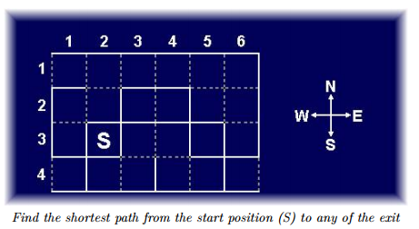

#### 【题目链接】
[UVa 10384](https://uva.onlinejudge.org/index.php?option=com_onlinejudge&Itemid=8&page=show_problem&problem=1325) The Wall Pusher

#### 【题目描述】
如图所示的迷宫，格子之间有一些墙壁，从Ｓ出发，每次可以往东、南、西、北四个方向之一前进，如果前方有墙壁，那么玩家可以把墙壁往前推一格，如果有连续两堵及以上的墙壁，则不能推动。另外玩家也不能推动迷宫边界上的墙壁。
边界处没有墙的地方就是出口，可能不止一个，给定Ｓ的坐标，用最少的步数走出迷宫。迷宫总是有4行6列，多解时任意输出一个移动序列（用WNES表示即可）。



<!--more-->

#### 【解题思路】

理论上BFS应该也能做，但状态的表示太麻烦。
考虑使用IDA*算法，可还有一个关键问题，如何表示墙壁与墙壁的移动？
我们可以从输入格式中得到启示。
我们使用数字[0, 4)来分别表示WNES四个方向，对于每一个格子，用一个四位二进制数来表示它周围的墙壁情况，该数的二进制第k位将表示该格子的k方向有无墙壁，（输入就是直接给出的这种格式）。

那么判断点$(x, y)$的$k$方向是否有墙壁就只需要这样写了：
```c++
inline bool hasWall(int x, int y, int k){
    return G[x][y] & (1 << k);
}
```
对于一次推动墙壁，一般涉及到三个格子，即当前格，下一格，下一格的下一格。
用$(x_0， y_0)，(x_1，y_1)，(x_2，y_2) $表示。
如何进行推格子的操作呢，只需要使用 异或 就行了。
```
// push
G[x0][y0] ^= 1 << k;
G[x1][y1] ^= 1 << k, G[x1][y1] ^= 1 << rev[k];
G[x2][y2] ^= 1 << rev[k];
```
（在程序中还需要注意越界的判断）
其中rev[k]表示k方向的反方向，提前写出来，实际上在本程序中rev[k] = (k + 2) % 4。

至于每次扩展后的恢复现场，只需要再异或一次，因为 异或 具有开关性（$a\ xor\ b\ xor\ b = a\ xor\ 0 = a$）

剪枝的话，我是以当前点到最近的一个出口的曼哈顿距离为乐观估价函数，不过因为棋盘比较小，计算这个函数的时间耗费也不少，所以剪枝效果并不是很好，时间只是由 0.726s 降低到 0.439s 。

#### 【AC代码】
注意读入的是S点的坐标(x, y)，也就是说S是第y行的第x点，这一点挺坑．．．
还是要注意细节。
```c++
#include <cstdio>
#include <climits>
#include <cmath>
#include <algorithm>

#define MAXSTEP 1000

const int m = 4, n = 6;

int G[m][n];
int Sx, Sy;

const char dir[5] = "WNES";
const int dx[4] = { 0, -1, 0, 1};
const int dy[4] = {-1,  0, 1, 0};
const int rev[4] = {2, 3, 0, 1};

int a[MAXSTEP];
int limit;

inline bool inMap(int x, int y){
    return 0 <= x && x < m && 0 <= y && y < n;
}

inline bool hasWall(int x, int y, int k){
    return G[x][y] & (1 << k);
}

inline bool outOfMaze(int x, int y, int k){
    return !hasWall(x, y, k) && !inMap(x + dx[k], y + dy[k]);
}

inline int manhattan(int x1 ,int y1, int x2, int y2){
    return abs(x1 - x2) + abs(y1 - y2);
}

inline int minManhattan(int x, int y){
    int ans = INT_MAX;
    for(int i = 0; i < m; i++){
        if(!hasWall(i, 0, 0)) ans = std::min(ans, manhattan(x, y, i, 0));
        if(!hasWall(i, n - 1, 2)) ans = std::min(ans, manhattan(x, y, i, n -1));
    }
    for(int j = 0; j < n; j++){
        if(!hasWall(0, j, 1)) ans = std::min(ans, manhattan(x, y, 0, j));
        if(!hasWall(m - 1, j, 3)) ans = std::min(ans, manhattan(x, y, m - 1, j));
    }
    return ans;
}

bool dfs(int d, int x0, int y0){
    if(d == limit){
        for(int k = 0; k < 4; k++){
            if(outOfMaze(x0, y0, k)){
                a[d] = k;
                return true;
            }
        }
        return false;
    }
    else if(d + minManhattan(x0, y0) > limit) return false;
    else for(int k = 0; k < 4; k++){
        a[d] = k;
        int x1 = x0 + dx[k], y1 = y0 + dy[k];
        int x2 = x1 + dx[k], y2 = y1 + dy[k];

        if(!inMap(x1, y1)) continue;

        if(hasWall(x0, y0, k)){
            if(hasWall(x1, y1, k)) continue;
            else{
                // Push
                G[x0][y0] ^= 1 << k;
                G[x1][y1] ^= 1 << k, G[x1][y1] ^= 1 << rev[k];
                if(inMap(x2, y2)) G[x2][y2] ^= 1 << rev[k];

                if(dfs(d + 1, x1, y1)) return true;
                
                // Pull
                G[x0][y0] ^= 1 << k;
                G[x1][y1] ^= 1 << k, G[x1][y1] ^= 1 << rev[k];
                if(inMap(x2, y2)) G[x2][y2] ^= 1 << rev[k];
            }
        }
        else if(dfs(d + 1, x1, y1)) return true;
    }

    return false;
}

inline void solve(){
    for(limit = 1; ; limit++){
        if(dfs(0, Sx, Sy)){
            for(int i = 0; i <= limit; i++) putchar(dir[ a[i] ]);
            putchar('\n');
            break;
        }
    }
}

int main(){
    while(scanf("%d%d", &Sy, &Sx) == 2 && Sx){
        Sx--, Sy--;
        for(int i = 0; i < m; i++){
            for(int j = 0; j < n; j++){
                scanf("%d", G[i] + j);
            }
        }
        solve();
    }
    return 0;
}
```
就这样啦