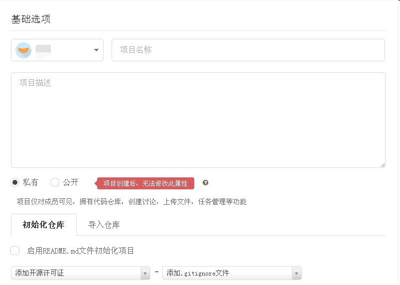
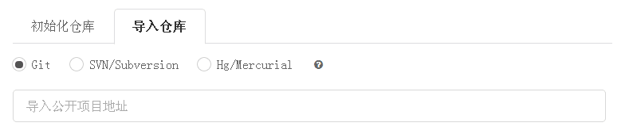
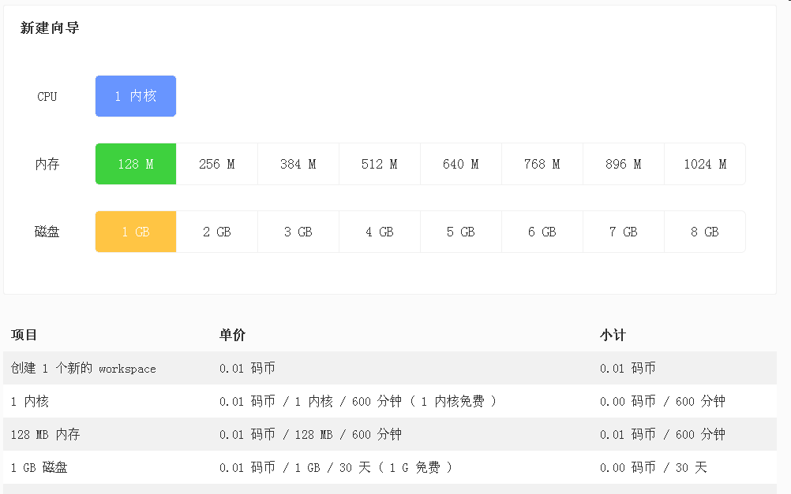
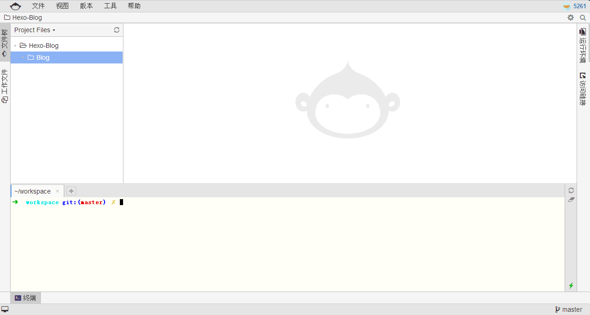
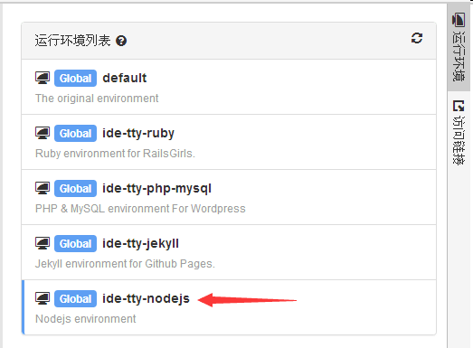

## 前言
`Hexo` 是一款优秀的静态博客框架。

本站便是使用 `Hexo` 构建，并托管在 `Github Pages` 服务上。

但是想要使用 `Hexo` 维护博客，需要配置本地环境，安装 `Git` `Nodejs` `Hexo` 等软件，并且要同步 Blog 的源码。

于日常的办公环境而言，这些也倒是必备，然而因为没有笔记本等方便随身携带的设备，出身在外时，更新 Blog 便成了一件麻烦的事，尤其是手上只有 Windows 环境的情况下，问题重重。

Blog 源码可以扔到 `Github` 上面，作为一个项目维护，这样便无需担心同步的麻烦，主要在于如何快速的配置使用 `git` 及 `hexo` 的环境。

通过折腾，终于采用了 `Coding` 提供的 `WebIDE` 解决了这个问题。

<!--more-->

## Coding 是什么？

官方介绍
> Coding 是一个面向开发者的云端开发平台，目前提供代码托管，运行空间，质量控制，项目管理等功能。此外，还提供社会化协作功能，包含了社交元素，方便开发者进行技术讨论和协作。

值得一提的是，2016 年 3 月 `Coding` 宣布收购代码托管平台 `GitCafe` 。

在诸多功能中，`Coding WebIDE` 是我们今天的目标。

> Coding WebIDE 是 Coding 自主研发的在线集成开发环境 (IDE)。用户可以通过 WebIDE 创建项目的工作空间, 进行在线开发, 调试等操作。同时 WebIDE 集成了 Git 代码版本控制, 用户可以选择 Coding、GitHub、BitBucket、Git@OSC 等任意的代码仓库。 WebIDE 还提供了分享开发环境的功能, 用户可以保存当前的开发环境, 分享给团队的其他成员。

也就是说，这是一个在线的开发环境，完全可以支持我们 `Git` + `Nodejs` + `Hexo` 的需求，配置好后，我们就可以直接在浏览器中方便地维护 Blog 啦！

我们假设读者有在本地配置 `Hexo` 的经验。

## 使用方法

首先注册 Coding 账号， 官网 -> [Coding](https://coding.net)。

登陆，点击右上角图标，来到用户界面下。


然后创建项目：


填写基本信息：



如果你已经将 Blog 源码传到 `Github` 上，那么可以直接导入：



不然，保持默认即可。

接下来，新建工作空间(workspace)，打开 [Coding WebIDE](https://ide.coding.net)，选择新建工作空间：


选择配置：



这里问题来了，这是收费的？并非直接收费，而是通过一种叫做「码币」的虚拟货币，可以通过参加 Coding 的一系列活动获得。

创建后，即可使用 `WebIDE`。



首先其自带`git`，在右侧「运行环境」中，选择 `ide-tty-nodejs` 一项，即可拥有`
nodejs`：



在文件树中上传 Blog 源码，或者从 Github 中导入。

打开终端：

安装`Hexo`：

```
sudo npm install hexo-cli -g
```
切换到 Blog 目录，安装`node_modoules`中的模块：

```
sudo npm install
```

现在，`Hexo` 就可以使用了！使用方法和本地一样。我们可以自由地新建文章，直接在 `WebIDE` 中写作（考虑到计时收费的问题，还是在本地写好再粘上去吧），也可以即时预览。

预览方法：运行 `hexo s` 命令后，在右侧 访问链接 生成端口 `4000`，点击即可访问。

使用`Coding`的最大方便就在于，本次配置好后，下次打开无需重新配置，直接就可以使用环境，尽情享受吧！

## 后记
`Coding` 的 `WebIDE` 为我们提供了方便的开发环境，为我们节约了配置环境的时间，使我们能够随时随地方便地管理自己的 Blog，简单而高效，也许唯一需要担心的就是这个收费的问题咯...
